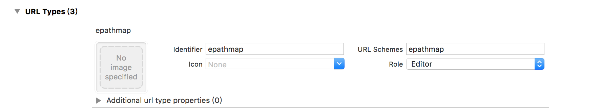

# EpathmapSDK-iOS

EpathmapSDK-iOS 是一套基于 iOS 8.0 及以上版本的室内地图应用程序开发接口，供开发者在自己的iOS应用中加入室内地图相关的功能，包括：地图显示（多楼层、多栋楼）、室内导航、模拟导航、语音播报等功能。

## 获取AppKey
请填写
**[申请表](申请表.xlsx链接)**
给dev@epathMap.com邮件联系获取AppKey、mapId、scheme（分享用）

## 使用CocoaPods部署
在Podfile中使用命令如下：
```bash
pod 'EpathmapSDK', '~> 0.1.0'
```
然后运行以下命令

```bash
$ pod install
```
### 注意
导入EpathmapSDK后需要
- Build Settings中将Enable Bitcode 改成 NO。
- 在Info.plist中添加授权申明
```bash
<key>NSBluetoothPeripheralUsageDescription</key>
<string>App需要您的同意,才能访问蓝牙为您提供室内导航服务</string>
<key>NSContactsUsageDescription</key>
<string>App需要您的同意,才能访问通讯录为您提供好友位置共享等功能</string>
<key>NSLocationWhenInUseUsageDescription</key>
<string>App需要您的同意,释途才能在室外定位及导航等服务中使用您的位置信息 </string>
<string>App需要您的同意,释途才能在室外定位及导航等服务中使用您的位置信息</string>
<key>NSMicrophoneUsageDescription</key>
<string>App需要您的同意,释途才能在语音搜索中使用您的麦克风 </string>
```

## 使用说明
### 显示室内地图
```objective-c
EpathMapViewController *vc = [[EpathMapViewController alloc] initWithMapId:(NSString *)MapId];
[self.navigationController pushViewController:vc animated:YES];
```
### 导航至具体地址
```objective-c
EpathMapViewController *vc = [[EpathMapViewController alloc] initWithMapId:(NSString *)MapId targetName:@"饮水机" targetId:@"yinshuiji"];
vc.locationShareDelegate = [EpathLocationShareHandle sharedInstance];
[self.navigationController pushViewController:vc animated:YES];
```
### 是否在地图范围内的接口
```objective-c
- (void)viewDidLoad {
[super viewDidLoad];
// Do any additional setup after loading the view.
self.view.backgroundColor = [UIColor whiteColor];

self.manger = [EpathmapLocationManger new];
self.manger.locationTimeOut = 20;
self.manger.delegate = self;

[self.manger startLocationEngine:(NSString *)MapId];
}

- (void)ipsmapLocationManager:(EpathmapLocationManger *_Nullable)manager didUpdateLocation:(EpathLocationInfo *_Nullable)location
{
if (location.inThisMap) {
NSLog(@"在建筑物内");
}
}
```

### 位置共享功能

## 使用粘贴板实现

1、在 didFinishLaunchingWithOptions里面创建好window之后添加
```objective-c
//检测位置共享口令是否存在
[[NSNotificationCenter defaultCenter] addObserver:self selector:@selector(epathReceiveShareInfo:) name:IpsReceiveShareInfoNotification object:nil];
   [[EpathmapServices sharedInstance] application:application didFinishLaunchingWithOptions:launchOptions];
   ```
   2、在applicationWillEnterForeground里添加
   ```objective-c
   [[EpathmapServices sharedInstance] applicationWillEnterForeground:application];
   ```
   3、通知响应处理
   ```objective-c
   - (void)epathReceiveShareInfo:(NSNotification *)noti {
   if (noti.object == nil || ![noti.object isKindOfClass:[UIView class]]) {
   return;
   }
   
   UIView *viewJoin = (UIView *)noti.object;
   //有分享口令
   dispatch_after(dispatch_time(DISPATCH_TIME_NOW, (int64_t)(1 * NSEC_PER_SEC)), dispatch_get_main_queue(), ^{
   [viewJoin performSelector:@selector(showInView:) withObject:[UIApplication sharedApplication].keyWindow];
   });
   }
   ```
   
   ## 使用微信分享SDK实现（SDK1.1.6开始使用）
   1、开发者可在自己的工程中接入微信SDK并完成register
   ```objective-c
   //例如在didFinishLaunchingWithOptions实现register
   [WXApi registerApp:wxAppID];
   ```
   2、将获取到的scheme配置到自己的工程中
   
   
   
   3、在每个EpathMapViewController创建完之后加上locationShareDelegate处理分享按钮点击的回调
   ```objective-c
   //设置需要分享的平台
   [EpathShareConfig showSharePlatforms:@[@(IpsShareTypeWeChat), @(IpsShareTypeQQ), @(IpsShareTypeSMS)]];
   
   EpathMapViewController *vc = [[EpathMapViewController alloc] initWithMapId:(NSString *)MapId];
   vc.locationShareDelegate = [EpathLocationShareHandle sharedInstance];
   [self.navigationController pushViewController:vc animated:YES];
   ```
   4、分享按钮点击的回调处理可以用demo中的EpathLocationShareHandle也可以自己写
   
   5、点击分享链接App的处理在Appdelegate中的handleOpenURL方法加处理事件,delegate 需要支持EpathLocationShareProtocol协议
   ```objective-c
   - (BOOL)application:(UIApplication *)application handleOpenURL:(NSURL *)url {
   if ([url.scheme isEqualToString:wxAppID]) {
   return [WXApi handleOpenURL:url delegate:self];
   } else if ([url.scheme isEqualToString:epScheme])
   return [[EpathmapServices sharedInstance] application:application openURL:url delegate:[EpathLocationShareHandle sharedInstance]];
   return YES;
   }
   ```
   
   6、为了方便位置共享可以默认填写用户昵称，可在登录成功或者切换用户等获取到用户信息后传递用户信息
   ```objective-c
   EpathUserInfo *userInfo = [EpathUserInfo new];
   userInfo.name = @"张三";
   userInfo.phoneNumber = @"13888888888";
   [EpathmapServices sharedInstance].userInfo = userInfo;
   ```
   
